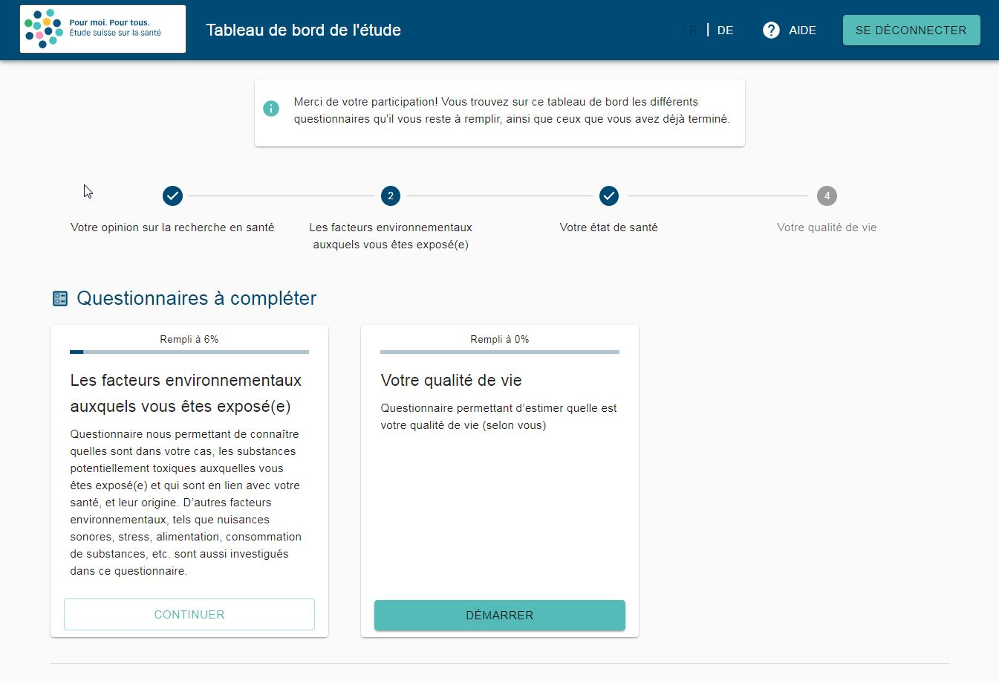
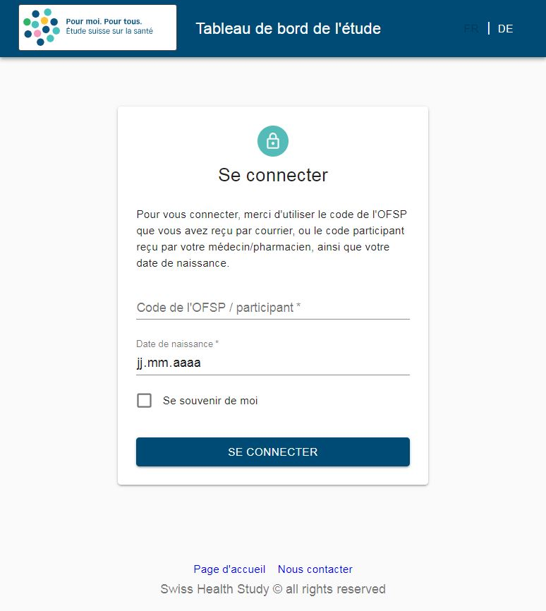
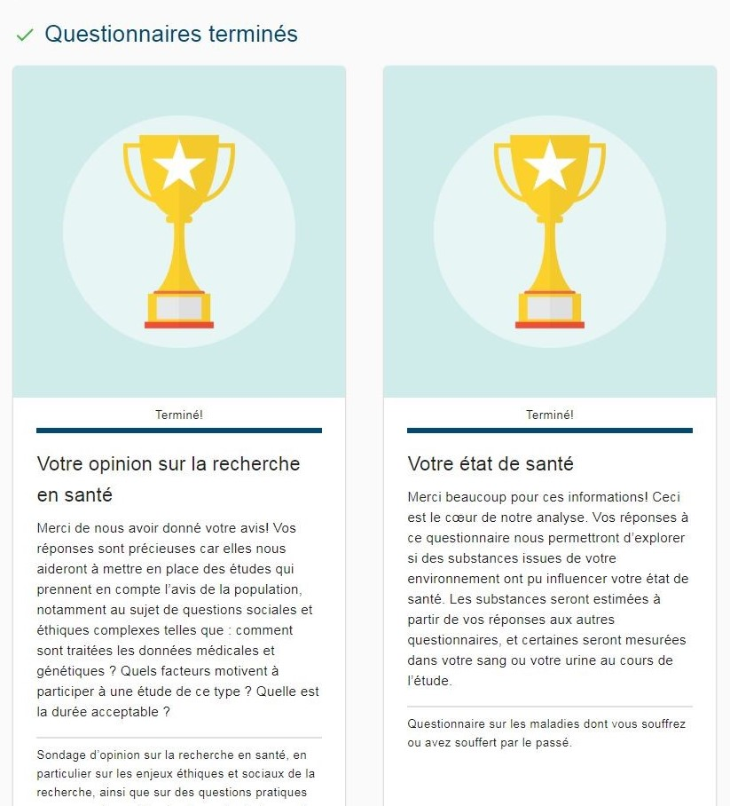
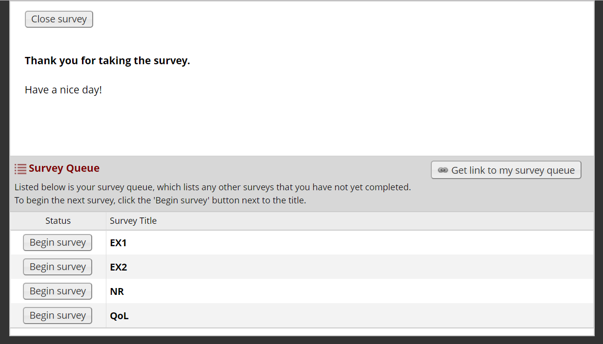

# Dashboard - Swiss Health Study

The Swiss Health Study aims at understanding the health status of the Swiss population at a national scale. In Mai 2017, the *Swiss Federal Council* approved the pilot study.

This project is a part of the IT infrastructure that was set up for the pilot study. It consists of the main webpage (dashboard) on which all study participants land. On this page, a participant can see the remaining questionnaires that he needs to fill in, his current progression, and some "rewards" for all the forms that he has already completed.

The goal of this dashboard are the following:
- Motivate the study participants to complete all of the (many) forms of the study, through a reward system.
- Provide a great user experience
- Add a login system to provide some protection to the user
- Integrate with the IT infrastructure of the study (REDCap)

Here are some screenshots of the finished dashboard:

  

Login screen and reward screen:

  
  

*As reference, here was the **previous dashboard** of the study:*

  

